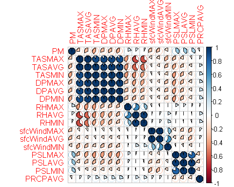
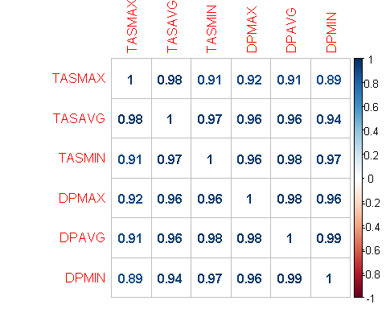

  

# Is there significant correlation between the PM variable and any of the meteorological indicators?
  

```r
st9572A <- read.csv("st9572A.csv")
st9572A <- st9572A[,-1]
library(corrplot)
```

```
## Warning: package 'corrplot' was built under R version 3.6.3
```

```
## corrplot 0.84 loaded
```

```r
M<-cor(st9572A[,-1])
corrplot(M, method="pie")
```

<!-- -->
  
No, there is not really any strong correlation.  

# Is there significant correlation across pairs of meteorological indicators?
  
Yes, there is significant correlation between temperature and humidity (TAS and DP). This can be clearely observed on the graph. The exact values are:
  

```r
I = cor(st9572A[,c(3:8)])
corrplot(I, method="number")
```

<!-- -->


